# PWR DUBLIN

## User-Centric Frontend Development Milestone Project.

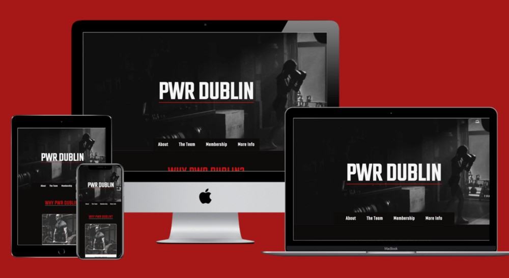

Welcome to PWR DUBLIN! A website designed for a fictional training facility in Dublin 15, encompassing the needs of powerlifters, bodybuilders and fighters all in one place. 

This website is tailored to both experineced athletes and fitness newbies looking to train and learn in a supporting and friendly environment. 

The site will be a hub for easily-accessible informative reading and critical information for potential clients. 

My goal is to achieve a professional-standard website using just HTML and CSS with room for further functionality in the future.

## [View the deployed website here!](https://ryanoneill416.github.io/pp1-pwrdublin/)
---

# Table of contents

- [UX](#ux)
    - [Website Owner Business Goals](#website-owner-business-goals)
    - [User Goals](#user-goals)
        - [New User Goals](#new-user-goals)
        - [Returning User Goals](#returning-user-goals)
    - [User Stories](#user-stories)
    - [Structure of The Website](#structure-of-the-website)
    - [Wireframes](#wireframes)
    - [Surface](#surface)
- [Features](#features)
- [Technologies Used](#technologies-used)
- [Testing](#testing)
    - [Functionality Testing](#functionality-testing)
    - [Compatibility Testing](#compatibility-testing)
    - [Bugs Encountered During Development](#bugs-encountered-during-development)
    - [Code Validation](#code-validation)
    - [Performance Testing](#performance-testing)
- [Deployment](#deployment)
- [Credits](#credits)
- [Screenshots](#screenshots)
# UX

## Website owner business goals

The motive for making this website is to provide an effective and appealing gym website for the business.
The website will present all pull factors associated with using this training facility in its entirety.
Also this website showcases such in a simple and efficient way to embody ease of use.
The webiste will showcase the personal trainers/staff that work here and the qualities they bring to the table.
The website will present membership packages with a range of specifity.

## User goals

### New user goals:
- New user is able to find information about the facilities the gym has to offer.
- New user can easily locate gym facilities, personal trainer information/ qualifications, and the prices of holding a membership.
- New user can find contact and location information of the gym.
- New user can fill out the 'Ask Us' form to ask any other queries they have regarding what the gym can offer.

### Returning user goals:
- Returning User can find more information on personal trainers if they believe they would benefit from such.
- Returning User can enquire about personal training through the form functionality on the website.
- Returning User can find out opening times of the gym and contact information that they may have become unaware of.
- Returning User can ask/ enquire about anything they wish using the same form. 
- Returning User can find relevant social media links to follow the gym on those platforms.

## User stories

### As a business owner:
* I would like to present all of the facilities of my gym in an appealing and effective manner.
* I want to showcase the team of employees working here that make the gym the friendly/ welcoming environment it should be.
* I need to make sure that my current and new customers will find crucial information on what we have to offer and relevant pricing.
* I want my customers to be able to learn how to use my website intuitively and easily.
* I would like to build and maintain relationship with potential and current customers.

### As a new customer:
* I would like to know what facilities/ equipment the gym has to offer for my training preferences. 
* I wish to find information about the personal trainers and what services they have to offer.
* I want to know what prices/ promotions are available if I'm a regular member or a student.
* I want to know general gym contact and location information.

### As a returning customer:

* I need to enquire about personal training with a specific trainer
* I would like to check opening times on specific days if I am unsure.
* I want to send the website to my friend to show him why he/she can join too.
* I would like to make an enquiry about miscellaneous things such as endorsements/ business/ recruitment etc. using the form

## Structure of the website

The website is designed to be an easy-to-use one page design with an intuitive layout providing the user with what is needed most in a progressive order.
It is crucial that the website is as effective/ intuitive to use on desktop/ tablets and mobile without any exception.
All parts are designed to achieve maximum user satisfaction: Such as hover effects on the navigation links and form buttons as well as a back to top button at the bottom for ease of navigation.

## Wireframes

I used balsamiq.cloud to create my wireframes for desktop/ tablet and mobile.

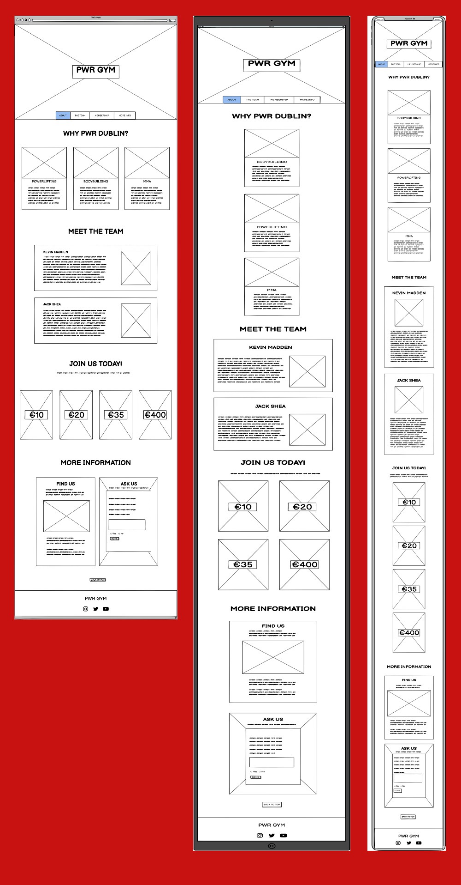

## Surface

### Colors
Main colors used in a project:
* Background: #0e0b0b.
* Font: #0e0b0b and whitesmoke.
* Headings: #c81212.
* Paragraph/ List Elements: #0e0b0b.

### Fonts 

* Headings/ Logo: Teko w/ a backup of Sans-serif.
* Paragraph/ List Elements: Poppins w/ a backup of Sans-serif.

### Images

* I used images from both [pexels.com](www.pexels.com) and [unsplash.com](www.unsplash.com). The pictures are credited individually in the [credits](#credits) section.

[Back to Table of contents](#table-of-contents)

___
# Features

The website encompasses a one-page format. It is divided into four main sections that exist between th header and footer.
The navigation menu is nested in the header before the foremost section of information.

The website has below features:

## Header
* The header is made up of a large monochrome hero image with the Gym's logo situated boldly in the center.
* The navigation is nestled at the bottom of the hero image.

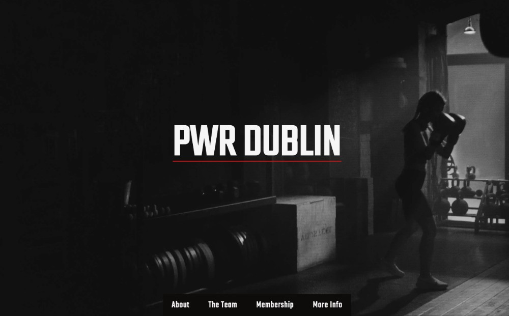

## Navigation bar

* Navigation bar is visible at the bottom of the header's hero image and below the logo. It is responsive and converts to take up the full width of devices that lack sufficient screen-width.
* Navigation scheme:

    * The navigation menu lies below the screen's center as the user lands on the page itself.
    * There are four navigation links and each consists of a hover animation with a vanishing underline in the color #c81212:
        * About
        * The Team
        * Membership
        * More Info

## About Section

* The about section outlines the most important information for a gym member, the facilites on offer.
* It contains three cards listing the facilities categorised into the following:
    * Powerlifting
    * Bodybuilding
    * MMA
* This section is the first section as it is what is deemed most important to somebody who is considering joining the gym.

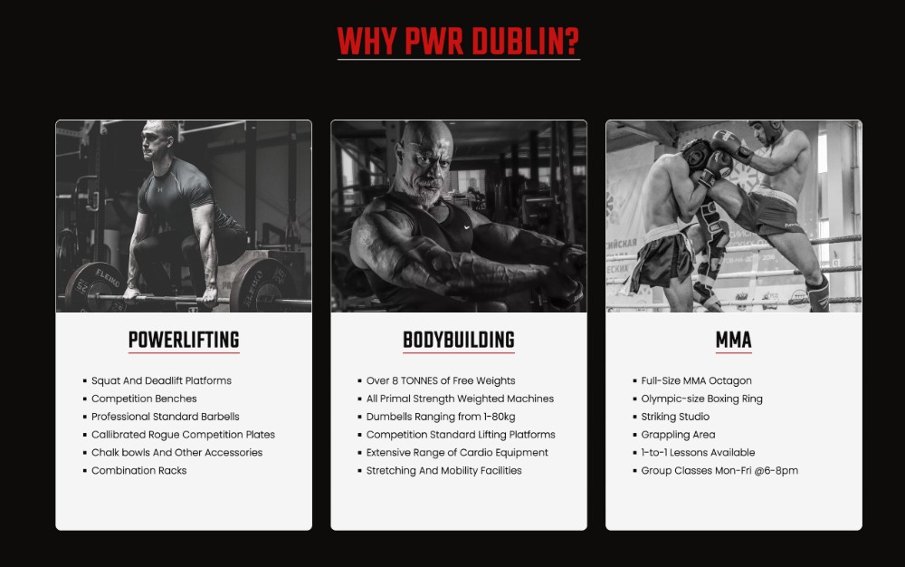

## The Team Section

* The team section showcases the two personal trainers available to help members to achieve their desired fitness goals.
* Each employee is given their own heading in conjuction with a list of what they bring to the table in terms of coaching.
* The aim of the list is to summarise the each trainer's qualifications and experience relevant to the coaching they provide.
* This section is crucial to experienced gym-goers looking to advance or complete newbies who need a helping hand.
* Friendly pictures are used of the employees to showcase the welcoming nature of the facility.

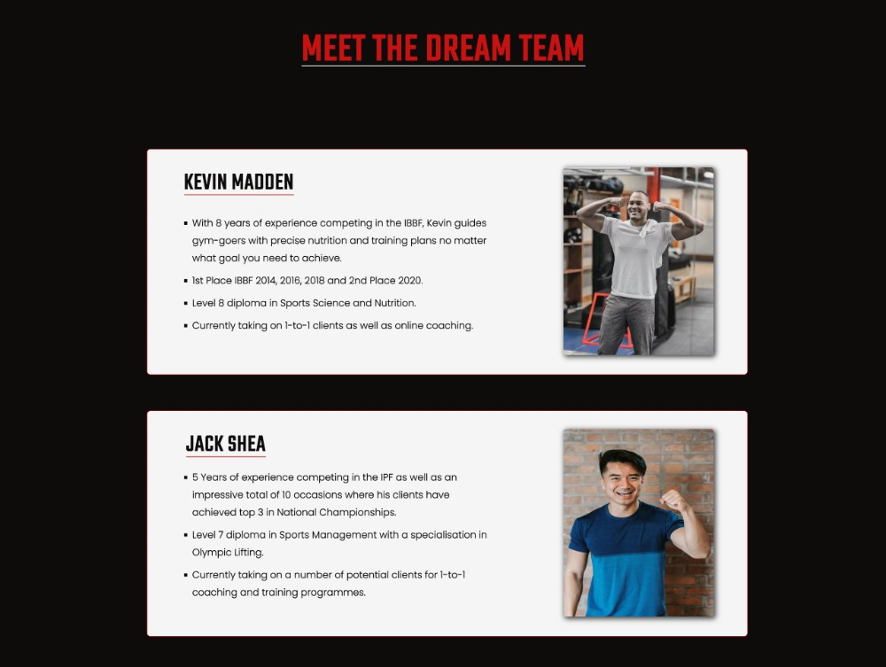

## Membership Section

* The membership section draws the user's attention with 4 loud and decorative pricing plans.
* Simplicity at it's finest, each card clearly outlines the time period and price-point of that given option.
* A pricing discount is included for students and is displayed under the section heading.
* The pricing list is as follows:
    * One Day: €10
    * One Week: €20
    * One Month: €35
    * One Year: €400
* Fine print is shown on the monthly membership price to inform users that such is a recurring monthly payment that is cancellable.

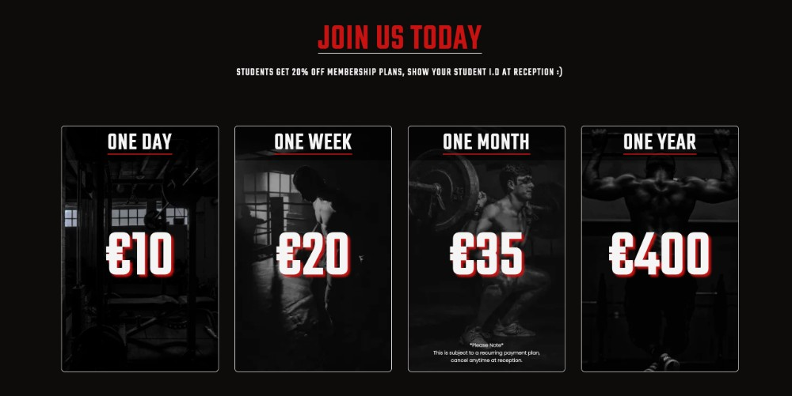

## More Information Section

* The more information section is divided into to parts: The 'Find Us' and 'Ask Us' cards.
* 'Find Us' Section:
    * Outlines the address at which the gym is found.
    * Includes an iframe element from google maps to allow users to further understand how to reach the facility.
    * Encloses all contact information that may be needed such as contact no., email addresses etc.
    * Provides contact information for hte personal trainers if potential clients have queries to enquire about.
* 'Ask Us' Section:
    * This is a form aimed at answering the questions of users who have any additional queries after navigating the website. 
    * The form requires a first name, last name, valid email addres, explanation and to opt in/ out of promotional emails and offers.
    * Includes categories in a dropdown list to categorise data:
        * Facilities
        * Coaching Enquiry: Kevin
        * Coaching Enquiry: Jack
        * Business
        * Other
    * PLEASE NOTE: This form is a so-called 'dummy' form as it does not store data, this was done to showcase my knowledge of forms in HTML and CSS.
    * When the form is submitted, an alternative version of the page is loaded and directed to the same section and with this, indicates to the user that their form has been submitted and they will be contacted soon.
    * Functionality to go back and submit another query is included in the form of an 'Ask Again' button which reverts to the previous version.
    * A background image is used here to make the form stand out also.
* A 'Back to Top" button lies at the bottom of the more information section to bring users back to the header and navigation links for the purpose of ease of navigation.

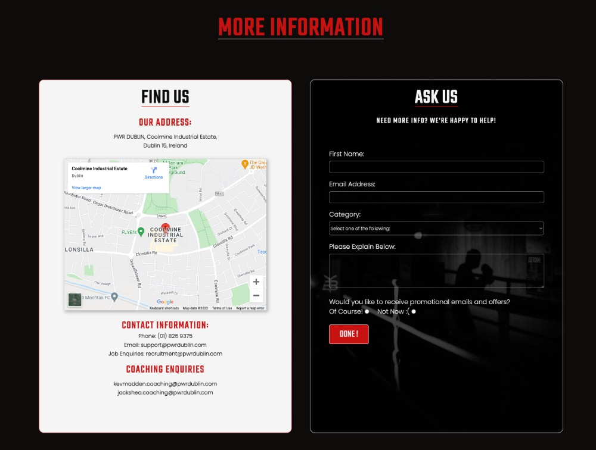

## Footer

* Footer is consistent on all pages. It houses a central logo the same as the one in the header.
* It contains three icons from [fontawesome.com](www.fontawesome.com) which are anchor elements that bring users to the corresponding gym page on the social media platform.
* Each link opens up in a new tab.

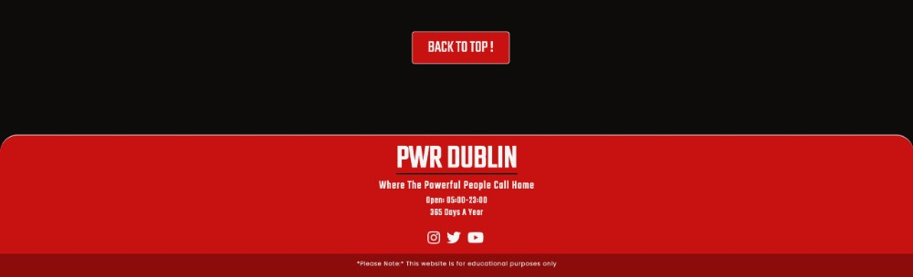

[Back to Table of contents](#table-of-contents)
___
# Technologies Used

### HTML5
* As a structure language.

### CSS
* As a style language.

### Font Awesome
* As an icon library for a social links.

### Google fonts
* As a font resource.

### GitHub
* As a software hosting platform to keep project in a remote location.

### Git
* As a version-control system.

### Gitpod
* As a development hosting platform.

### Balsamiq.cloud
* As a wireframing tool.

### Pixlr
* As an image editor.

[Back to Table of contents](#table-of-contents)

___
# Testing

## Functionality testing 

 I used Chrome dev tools throughout the project for testing and solving problems with responsiveness and style issues.
 This was used to identify issues with responsiveness as the screen sizes were adjusted in all possible scenarios.

## Compatibility testing

PWR Dublin was tested across multiple virtual mobile devices and browsers. I checked all supported devices using Safari, Chrome and Firefox.
* The following devices were used to test compatibility in person:
    * 13" Macbook Pro.
    * Lenovo ThinkPad.
    * Chromebook.
    * iPad Air.
    * iPhone 13. 
    * Samasung Galaxy s7.
    * iPhone 4s.
* Chrome developer tools was used in conjunction with this to test how the site would perform on devices such as the Galaxy Fold and even the Google Nest devices.

---
## Bugs Encountered During Development

## Using percentages as the height of elements:

This was the first issue I encountered during the development stage. It resulted in elements being unreadable and looking extremely unappealing on different devices due to the individual screen heights.

I solved the issue by giving the elements fixed heights using pixels instead.

## Logo underline appearance:

In the early stages of the project I was having a problem giving the logo a visually appealing underline. The issue arised because of how the default underline property wasn't positioned below the text.

I solved this issue by digging and learning about the text-underline-offset property.

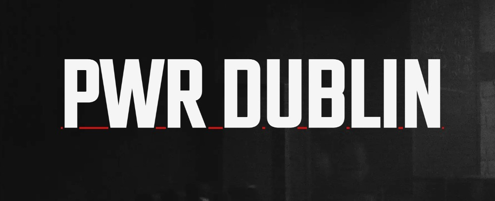

## Font awesome icon compatibility:

I discovered a problem with using the newest release of font awesome icons. The issue was that the version 6 of the icons was not being recognised by the browser and would result in a broken icon image.

To resolve this issue I reverted back to and used the previous version of the same font awesome icons.

## Use of fixed margins on devices with small screen width:

I was using margin values for the left and right of cards by using pixels however as the responsive was tested I realised that on small device widths this had resulted in the noticeable and unappealing narrowing of elements.

To solve this issue I introduced percentage values for the problematic margins in the media queries to compliment the appearance of the website on smaller devices.

## Horizontal scrolling bar on the bottom of the screen:

Upon noticing that the page had an unnecessary horizontal scrollbar, I sought to rectify this immediately.

To fix this I included the overflow-x style rule in the body tag as none of the elemnts on the website exceeded 100% of the screens width. 

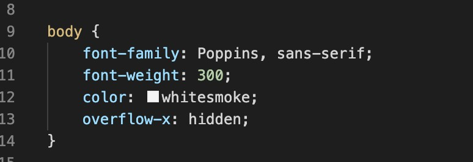

## Landing page appearance on devices with uncommon screen dimensions:

While testing responsiveness on numerous devices I found the site's appearance on devices of small screen height was not up to scratch. 

To fix this I added media queries to target the header appearance on such devices like the Nest Hub/ Nest Hub Max etc.

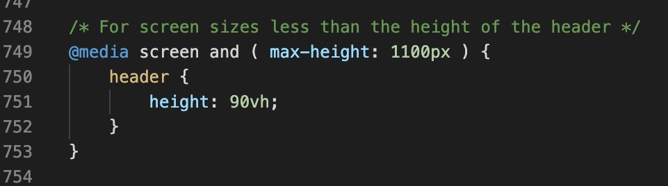

## Performance testing

I ran [Lighthouse](https://developers.google.com/web/tools/lighthouse/) tool to perform checks on the performance of the site
Some things I had to adjust performance-wise were as follows:
* Compress images used multiple times to reduce loading times.
* Convert images to .webp to significantly reduce file size.
* Use alternative version of header background image for smaller device sizes to be more efficient in processing.

See the lighthouse performance scores below:

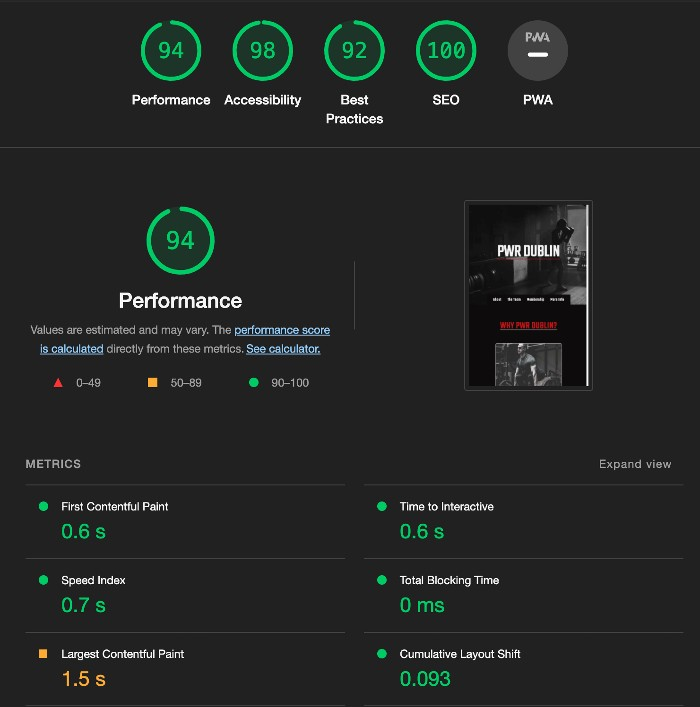

## Code Validation
 At the and of the project I used two websites to validate a code
 
 * [W3C CSS Validator](https://jigsaw.w3.org/css-validator/) to validate CSS
 * [Nu Html Checker](https://validator.w3.org/) to test HTML

[Back to Table of contents](#table-of-contents)

___
# Deployment

The PWR DUBLIN website is deployed using GitHub Pages. I used Gitpod as a development environment where I commited all changes to git version control system.
I used push command in Gitpod to save changes into GitHub.

To deploy the website I had to do the following:

* Log in to GitHub and click on repository to deploy ([pp1-pwrdublin](https://ryanoneill416.github.io/pp1-pwrdublin/)).
* Select the `Settings` tab and find GitHub Pages option at the bottom of the page.
* From branch select `main` and then `/(root)` as the directory.
* Click `Save` and the website was deployed after refreshing the page and giving github a few moments to process said request.
>  Your site is published at https://ryanoneill416.github.io/pp1-pwrdublin/

To run locally:
* Log in to GitHub and click on repository to download ([pp1-pwrdublin](https://ryanoneill416.github.io/pp1-pwrdublin/)).
* Select `Code` and click Download the ZIP file.
* After this is downloaded, the file can be extracted and ran in your chosen local environment :)

[Back to Table of contents](#table-of-contents)
___
# Credits

* To complete this project I used Code Institute student template: [gitpod full template](https://github.com/Code-Institute-Org/gitpod-full-template)

* Ideas and learning resources:

    * [w3schools.com](https://www.w3schools.com)

    * [css-tricks.com](https://css-tricks.com/)

    * [flexboxfroggy.com](https://flexboxfroggy.com)

### Code

* Navigation Hover Underline: [Animation hover](https://www.30secondsofcode.org/css/s/hover-underline-animation)
* Box-Shadow Styling: [Box-shadow](https://developer.mozilla.org/en-US/docs/Web/CSS/box-shadow)
* Transform Property: [Transform CSS](https://css-tricks.com/almanac/properties/t/transform/)

### Map:
* [Google maps](https://www.google.com/maps/place/Coolmine+Industrial+Estate,+Dublin/@53.3841962,-6.4034207,16z/data=!3m1!4b1!4m5!3m4!1s0x486772aeae33f3c3:0x1800c7a937ea3fe0!8m2!3d53.3841904!4d-6.3990433)

### Images:

#### Pexels.com:
* [ezgif.com-gif-maker.webp](https://www.pexels.com/@julia-larson)

* [header2.webp](https://www.pexels.com/@cottonbro)

* [pexels-cottonbro-4753898-min 2 (1) (1) (1).webp](https://www.pexels.com/@cottonbro)

* [pexels-cottonbro-4761616-min.webp](https://www.pexels.com/@cottonbro)

* [pexels-cottonbro-4761790-min.webp](https://www.pexels.com/@cottonbro)

* [pexels-alexa-popovich-9302141-min.webp](https://www.pexels.com/@alexapopovich/)

* [pexels-andres-ayrton-6551136-min.webp](https://www.pexels.com/@andres-ayrton)

* [pexels-grzegorz-5209197-min-min.webp](https://www.pexels.com/@grzegorz-2777274/)

* [pexels-ivan-remonte-4218662-min.webp](https://www.pexels.com/@ivan-remonte-2651426/)

* [pexels-leon-ardho-9602276(1)-min.webp](https://www.pexels.com/@leonardho/)

#### Unsplash.com:
* [brett-jordan-U2q73PfHFpM-unsplash-min.webp](https://unsplash.com/@brett_jordan)

* [edgar-chaparro-sHfo3WOgGTU-unsplash(1).webp](https://unsplash.com/@echaparro)

[Back to Table of contents](#table-of-contents)
___

 
 

