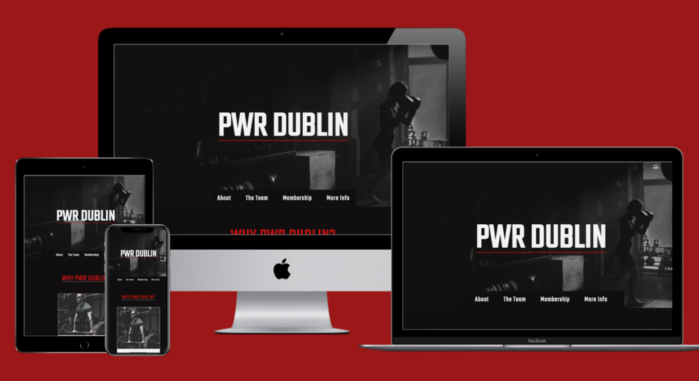

# PWR DUBLIN

## User-Centric Frontend Development Milestone Project.

Welcome to PWR DUBLIN! A website designed for a fictional training facility in Dublin 15, encompassing the needs of powerlifters, bodybuilders and fighters all in one place. 

This website is tailored to both experineced athletes and fitness newbies looking to train and learn in a supporting and friendly environment. 

The site will be a hub for easily-accessible informative reading and critical information for potential clients. 

My goal is to achieve a professional-standard website using just HTML and CSS with room for further functionality in the future.

## [View the deployed website here!](https://ryanoneill416.github.io/pp1-pwrdublin/)
---

# Table of contents

- [UX](#ux)
    - [Website owner business goals](#website-owner-business-goals)
    - [User goals](#user-goals)
        - [New user goals](#new-user-goals)
        - [Returning user goals](#returning-user-goals)
    - [User stories](#user-stories)
    - [Structure of the website](#structure-of-the-website)
    - [Wireframes](#wireframes)
    - [Surface](#surface)
- [Features](#features)
- [Technology](#technology)
- [Testing](#testing)
    - [Functionality testing](#functionality-testing)
    - [Compatibility testing](#compatibility-testing)
    - [Code Validation](#code-validation)
    - [User stories testing](#user-stories-testing)
    - [Issues found during site development](#issues-found-during-site-development)
    - [Performance testing](#performance-testing)
- [Deployment](#deployment)
- [Credits](#credits)
- [Screenshots](#screenshots)
# UX

## Website owner business goals

The motive for making this website is to provide an effective and appealing gym website for the business.
The website will present all pull factors associated with using this training facility in its entirety.
Also this website showcases such in a simple and efficient way to embody ease of use.
The webiste will showcase the personal trainers/staff that work here and the qualities they bring to the table.
The website will present membership packages with a range of specifity.

## User goals

### New user goals:
- New user is able to find information about the facilities the gym has to offer.
- New user can easily locate gym facilities, personal trainer information/ qualifications, and the prices of holding a membership.
- New user can find contact and location information of the gym.
- New user can fill out the 'Ask Us' form to ask any other queries they have regarding what the gym can offer.

### Returning user goals:
- Returning User can find more information on personal trainers if they believe they would benefit from such.
- Returning User can enquire about personal training through the form functionality on the website.
- Returning User can find out opening times of the gym and contact information that they may have become unaware of.
- Returning User can ask/ enquire about anything they wish using the same form. 
- Returning User can find relevant social media links to follow the gym on those platforms.

## User stories

### As a business owner:
* I would like to present all of the facilities of my gym in an appealing and effective manner.
* I want to showcase the team of employees working here that make the gym the friendly/ welcoming environment it should be.
* I need to make sure that my current and new customers will find crucial information on what we have to offer and relevant pricing.
* I want my customers to be able to learn how to use my website intuitively and easily.
* I would like to build and maintain relationship with potential and current customers.

