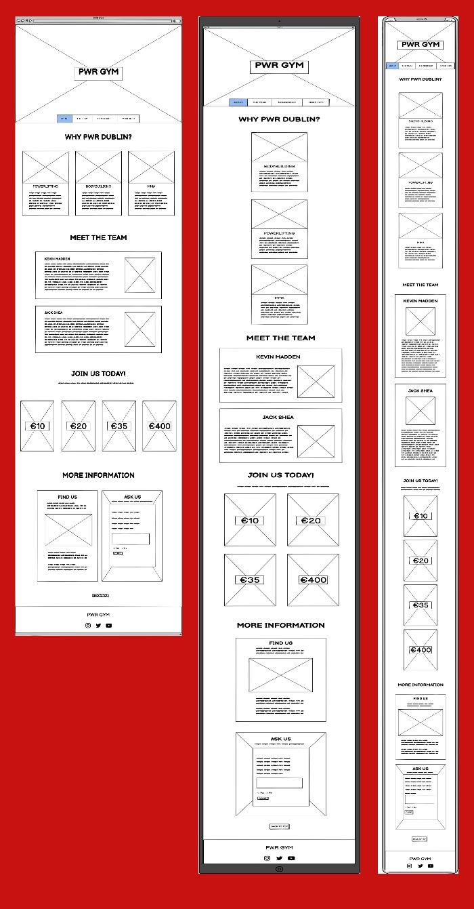

# PWR DUBLIN

## User-Centric Frontend Development Milestone Project.

Welcome to PWR DUBLIN! A website designed for a fictional training facility in Dublin 15, encompassing the needs of powerlifters, bodybuilders and fighters all in one place. 

This website is tailored to both experineced athletes and fitness newbies looking to train and learn in a supporting and friendly environment. 

The site will be a hub for easily-accessible informative reading and critical information for potential clients. 

My goal is to achieve a professional-standard website using just HTML and CSS with room for further functionality in the future.

## [View the deployed website here!](https://ryanoneill416.github.io/pp1-pwrdublin/)
---

# Table of contents

- [UX](#ux)
    - [Website owner business goals](#website-owner-business-goals)
    - [User goals](#user-goals)
        - [New user goals](#new-user-goals)
        - [Returning user goals](#returning-user-goals)
    - [User stories](#user-stories)
    - [Structure of the website](#structure-of-the-website)
    - [Wireframes](#wireframes)
    - [Surface](#surface)
- [Features](#features)
- [Technology](#technology)
- [Testing](#testing)
    - [Functionality testing](#functionality-testing)
    - [Compatibility testing](#compatibility-testing)
    - [Code Validation](#code-validation)
    - [User stories testing](#user-stories-testing)
    - [Issues found during site development](#issues-found-during-site-development)
    - [Performance testing](#performance-testing)
- [Deployment](#deployment)
- [Credits](#credits)
- [Screenshots](#screenshots)
# UX

## Website owner business goals

The motive for making this website is to provide an effective and appealing gym website for the business.
The website will present all pull factors associated with using this training facility in its entirety.
Also this website showcases such in a simple and efficient way to embody ease of use.
The webiste will showcase the personal trainers/staff that work here and the qualities they bring to the table.
The website will present membership packages with a range of specifity.

## User goals

### New user goals:
- New user is able to find information about the facilities the gym has to offer.
- New user can easily locate gym facilities, personal trainer information/ qualifications, and the prices of holding a membership.
- New user can find contact and location information of the gym.
- New user can fill out the 'Ask Us' form to ask any other queries they have regarding what the gym can offer.

### Returning user goals:
- Returning User can find more information on personal trainers if they believe they would benefit from such.
- Returning User can enquire about personal training through the form functionality on the website.
- Returning User can find out opening times of the gym and contact information that they may have become unaware of.
- Returning User can ask/ enquire about anything they wish using the same form. 
- Returning User can find relevant social media links to follow the gym on those platforms.

## User stories

### As a business owner:
* I would like to present all of the facilities of my gym in an appealing and effective manner.
* I want to showcase the team of employees working here that make the gym the friendly/ welcoming environment it should be.
* I need to make sure that my current and new customers will find crucial information on what we have to offer and relevant pricing.
* I want my customers to be able to learn how to use my website intuitively and easily.
* I would like to build and maintain relationship with potential and current customers.

### As a new customer:
* I would like to know what facilities/ equipment the gym has to offer for my training preferences. 
* I wish to find information about the personal trainers and what services they have to offer.
* I want to know what prices/ promotions are available if I'm a regular member or a student.
* I want to know general gym contact and location information.

### As a returning customer:

* I need to enquire about personal training with a specific trainer
* I would like to check opening times on specific days if I am unsure.
* I want to send the website to my friend to show him why he/she can join too.
* I would like to make an enquiry about miscellaneous things such as endorsements/ business/ recruitment etc. using the form

## Structure of the website

The website is designed to be an easy-to-use one page design with an intuitive layout providing the user with what is needed most in a progressive order.
It is crucial that the website is as effective/ intuitive to use on desktop/ tablets and mobile without any exception.
All parts are designed to achieve maximum user satisfaction: Such as hover effects on the navigation links and form buttons as well as a back to top button at the bottom for ease of navigation.

## Wireframes

I used balsamiq.cloud to create my wireframes for desktop/ tablet and mobile.

## Surface

### Colors
Main colors used in a project:
* Background: #0e0b0b.
* Font: #0e0b0b and whitesmoke.
* Headings: #c81212.
* Paragraph/ List Elements: #0e0b0b.

### Fonts 

* Headings/ Logo: Teko w/ a backup of Sans-serif.
* Paragraph/ List Elements: Poppins w/ a backup of Sans-serif.

### Images

* I used images from both [pexels.com](www.pexels.com) and [unsplash.com](www.unsplash.com). The pictures are credited individually in the [credits](#credits) section.

[Back to Table of contents](#table-of-contents)

___
# Features

The website encompasses a one-page format. It is divided into four main sections that exist between th header and footer.
The navigation menu is nested in the header before the foremost section of information.

The website has below features:

## Navigation bar

* #### Navigation bar is visible at the bottom of the header's hero image and below the logo. It is responsive and converts to take up the full width of devices that lack sufficient screen-width.
* Navigation scheme:

    * The navigation menu lies below the screen's center as the user lands on the page itself.
    * There are four navigation links and each consists of a hover animation with a vanishing underline in the color #c81212:
        * About
        * The Team
        * Membership
        * More Info

## About Section

* The about section outlines the most important information for a gym member, the facilites on offer.
* It contains three cards listing the facilities categorised into the following:
    * Powerlifting
    * Bodybuilding
    * MMA
* This section is the first section as it is what is deemed most important to somebody who is considering joining the gym.

## The Team Section

* The team section showcases the two personal trainers available to help members to achieve their desired fitness goals.
* Each employee is given their own heading in conjuction with a list of what they bring to the table in terms of coaching.
* The aim of the list is to summarise the each trainer's qualifications and experience relevant to the coaching they provide.
* This section is crucial to experienced gym-goers looking to advance or complete newbies who need a helping hand.
* Friendly pictures are used of the employees to showcase the welcoming nature of the facility.

## Membership Section

* The membership section draws the user's attention with 4 loud and decorative pricing plans.
* Simplicity at it's finest, each card clearly outlines the time period and price-point of that given option.
* A pricing discount is included for students and is displayed under the section heading.
* The pricing list is as follows:
    * One Day: €10
    * One Week: €20
    * One Month: €35
    * One Year: €400
* Fine print is shown on the monthly membership price to inform users that such is a recurring monthly payment that is cancellable.

## More Information Section

* The more information section is divided into to parts: The 'Find Us' and 'Ask Us' cards.
* 'Find Us' Section:
    * Outlines the address at which the gym is found.
    * Includes an iframe element from google maps to allow users to further understand how to reach the facility.
    * Encloses all contact information that may be needed such as contact no., email addresses etc.
    * Provides contact information for hte personal trainers if potential clients have queries to enquire about.
* 'Ask Us' Section:
    * This is a form aimed at answering the questions of users who have any additional queries after navigating the website. 
    * The form requires a first name, last name, valid email addres, explanation and to opt in/ out of promotional emails and offers.
    * Includes categories in a dropdown list to categorise data:
        * Facilities
        * Coaching Enquiry: Kevin
        * Coaching Enquiry: Jack
        * Business
        * Other
    * PLEASE NOTE: This form is a so-called 'dummy' form as it does not store data, this was done to showcase my knowledge of forms in HTML and CSS.
    * When the form is submitted, an alternative version of the page is loaded and directed to the same section and with this, indicates to the user that their form has been submitted and they will be contacted soon.
    * Functionality to go back and submit another query is included in the form of an 'Ask Again' button which reverts to the previous version.
    * A background image is used here to make the form stand out also.

